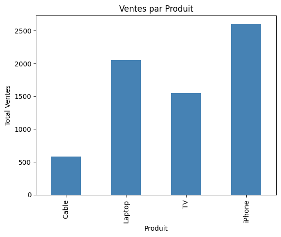
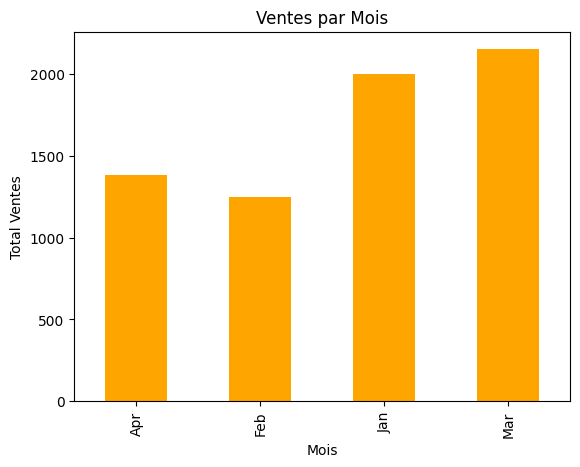
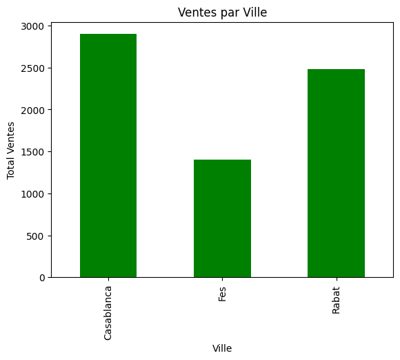

# 📊 Analyse des Ventes

Analyse exploratoire des données de ventes par produit, mois et ville.

## 📈 Visualisations

### Ventes par Produit

### Ventes par Mois

### Ventes par Ville

## 🛠️ Technologies utilisées
- Python
- Pandas
- Matplotlib

## 👤 Auteur
**Chaouch Anouar** — [GitHub](https://github.com/Anouar-analyst)
